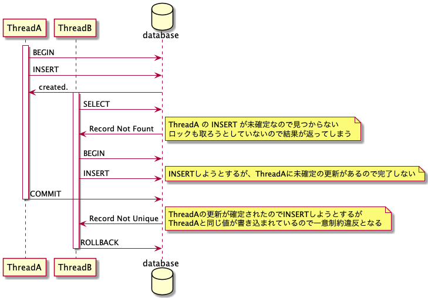

# README

  find_or_create_by で ActiveRecord::NotUnique が発生する件について調査しました。

## レースコンディションにより、find_or_create_by が ActiveRecord::NotUnique が発生してしまうパターン

```ruby
  Thread.new do
    Blog.transaction do
      Blog.create(title: 'hoge')
      sleep 10
    end
  end

  Thread.new do
    sleep 1
    Blog.find_or_create_by(title: 'hoge')
    # => Mysql2::Error: Duplicate entry 'hoge' for key 'index_blogs_on_title' (ActiveRecord::RecordNotUnique)
  end
```

```
   (0.4ms)  SET NAMES utf8mb4,  @@SESSION.sql_mode = CONCAT(CONCAT(@@sql_mode, ',STRICT_ALL_TABLES'), ',NO_AUTO_VALUE_ON_ZERO'),  @@SESSION.sql_auto_is_null = 0, @@SESSION.wait_timeout = 2147483
   (0.1ms)  BEGIN
  Blog Create (0.3ms)  INSERT INTO `blogs` (`title`, `created_at`, `updated_at`) VALUES ('hoge', '2021-05-24 04:48:12.456065', '2021-05-24 04:48:12.456065')
   (0.4ms)  SET NAMES utf8mb4,  @@SESSION.sql_mode = CONCAT(CONCAT(@@sql_mode, ',STRICT_ALL_TABLES'), ',NO_AUTO_VALUE_ON_ZERO'),  @@SESSION.sql_auto_is_null = 0, @@SESSION.wait_timeout = 2147483
  Blog Load (0.3ms)  SELECT `blogs`.* FROM `blogs` WHERE `blogs`.`title` = 'hoge' LIMIT 1
   (0.1ms)  BEGIN
   (0.3ms)  COMMIT
  Blog Create (9010.2ms)  INSERT INTO `blogs` (`title`, `created_at`, `updated_at`) VALUES ('hoge', '2021-05-24 04:48:13.452145', '2021-05-24 04:48:13.452145')
   (0.3ms)  ROLLBACK
```



```ruby
  Blog.count
  # => 1
```

## find_or_create_by で SELECT FOR UPDATE して、デッドロックを回避するパターン

```ruby
  Thread.new do
    Blog.transaction do
      Blog.create(title: 'fuga')
      sleep 10
    end
  end

  Blog.transaction do
    sleep 1
    Blog.lock.find_or_create_by(title: 'fuga')
  end
```

```
   (0.4ms)  SET NAMES utf8mb4,  @@SESSION.sql_mode = CONCAT(CONCAT(@@sql_mode, ',STRICT_ALL_TABLES'), ',NO_AUTO_VALUE_ON_ZERO'),  @@SESSION.sql_auto_is_null = 0, @@SESSION.wait_timeout = 2147483
   (0.8ms)  SET NAMES utf8mb4,  @@SESSION.sql_mode = CONCAT(CONCAT(@@sql_mode, ',STRICT_ALL_TABLES'), ',NO_AUTO_VALUE_ON_ZERO'),  @@SESSION.sql_auto_is_null = 0, @@SESSION.wait_timeout = 2147483
   (0.2ms)  BEGIN
  Blog Create (0.3ms)  INSERT INTO `blogs` (`title`, `created_at`, `updated_at`) VALUES ('fuga', '2021-05-24 04:51:36.143495', '2021-05-24 04:51:36.143495')
   (0.2ms)  BEGIN
   (0.3ms)  COMMIT
  Blog Load (9006.5ms)  SELECT `blogs`.* FROM `blogs` WHERE `blogs`.`title` = 'fuga' LIMIT 1 FOR UPDATE
   (0.2ms)  COMMIT
```


```ruby
  Blog.count
  # => 1
```
